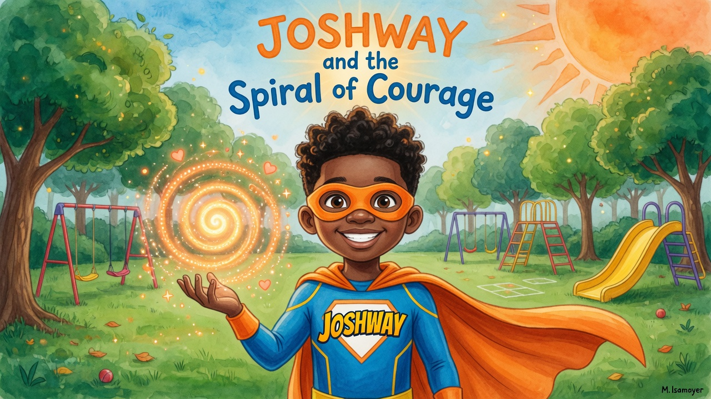

# JOSHWAY: Courage to Rise

**A 3D Star Coin Adventure**

Play as Joshway in a legacy-style 3D collectathon. Collect all the Star Coins in each world to unlock the Courage Portal and RISE to the next environment!

Worlds:
- Cozy Living Room (tight platforming)
- Backyard (outdoor fun)
- Playground Realm (the heart)
- City Lights
- The Moon (low gravity, dreamy)
- Open Starfield (NEW: zero gravity open space with stars, momentum-based flight, floating 3D coins - different dynamics to reach Mars!)
- Red Mars
- Volcanic Io (Jupiter's moon - mysterious challenges)

Deployed at: https://joshway-starcoins.vercel.app
(Production Vercel project under AllianceOptimalLLC team: joshway-starcoins. Standalone deployment at root. For joshway.app/starcoins slug integration: add rewrites in the main project's vercel.json or use subdomain alias like starcoins.joshway.app.)

**Latest Production Deploy:** https://joshway-starcoins.vercel.app (via `vercel --prod --yes --scope allianceoptimal`)

Full Joshway Collection Live:
- Star Coins 3D: https://joshway-starcoins.vercel.app
- Pinball: https://joshway-pinball.vercel.app
- Speed: https://joshway-speed.vercel.app
- Flash Odyssey: https://joshway-flash-odyssey.vercel.app

GitHub: https://github.com/AllianceOptimalLLC/Joshway-Game-Coin-Star

Each world has its own unique chiptune music, coin challenges, gravity, and funny CPU pals (kids, toys, aliens) that bump, distract, and entertain without harming you.

HOLD SPACE to rise high with your cape as long as courage lasts. Refuel at orbs. High ceilings and epic verticality!

Inspired by Maggie Isamoyer's gorgeous illustrations for the Joshway books.



**Theme reference:** The visuals and story are inspired by the wonderful illustrations of Artist Maggie (Maggie Isamoyer) for the Joshway children's book series.

The game world translates the book' s playgrounds, glowing courage light, friendship, and "rise" motif into an interactive 3D experience.

## Features
- Fully 3D retro-inspired multi-world adventure: 8 themed worlds (Living Room to Volcanic Io)
- Original hero Joshway + friends (4 selectable with live 3D cape previews)
- Smooth third-person controls with pointer lock, double jump + HOLD SPACE cape rise (energy meter + refuels)
- 12 required Star Coins + 3+ SECRET bonus coins per world (isSecret, extra score, drifting in zero-g)
- Level select with 4x2 grid, mini 3D world previews, highscores (incl. secrets), unlock progression, PLAY SELECTED button
- Unique chiptune music per level, funny interactive NPCs (E to talk + bump), powerups (Energy/Magnet/Surge/Boost)
- Procedural textures, particles, portals, win/score/highscore save (localStorage), pause, full credits on completion
- Retro pixel UI, special zero-g Starfield momentum flight
- Win screen with time + bests + full story/credits for last world

## Controls
- **Click** the game to lock mouse cursor (pointer lock for full look)
- **WASD** / Arrow keys — Move (A/D strafe correctly)
- **Space** — Jump. Press again in the air for a double-jump + jet boost. **HOLD SPACE** to continuously RISE with your cape (uses courage/energy)
- **Hold Space** (while airborne) — Keep thrusting with the jetpack/cape. Refuel at orbs to climb higher!
- **Mouse** — Freely look around (full 3D)
- **E** — Talk to funny NPC pals (nearby) for hints + small courage refill. They bump playfully!
- **M** — Toggle chiptune music
- **ESC** — Release mouse cursor / PAUSE
- **R** or **P** (on win screen) — Replay
- **LEVEL SELECT** on win/pause: pick any unlocked world with 3D previews + high scores. Click cards then PLAY SELECTED WORLD (or main BEGIN)

Special: Zero-g Starfield uses momentum-based full 3D thrust. Secrets drift. Power-ups: Energy, Magnet, Surge, Boost! 

8 worlds progression: complete all 12 coins (find 3+ secret bonus stars per world) to unlock next portal by RISING into it.

## Run Locally

```bash
# 1. Install dependencies (already done if you ran npm install)
npm install

# 2. Start the development server
npm run dev
```

The game will open automatically at **http://localhost:5173**

Press the big **START MISSION** button and enjoy!

You can also build for static hosting:

```bash
npm run build
# Then serve the `dist` folder
```

## Tech
- Vite + Three.js (WebGL + WebGPU renderer support)
- GLTFLoader included — ready for real 3D models
- Pure JavaScript (no extra heavy frameworks)
- All assets generated procedurally (textures, character model, particles, sounds)

Tech note: We evaluated Babylon.js, PlayCanvas, Godot web exports, and raw WebGPU. For a lightweight single-level nostalgic browser game, enhanced Three.js is the sweet spot.

## Credits & Inspiration
Created as a personal web homage to classic 3D toy adventure games.  
The bedroom, jetpack flight, and golden coin collecting are directly inspired by the provided reference video.

Enjoy collecting every last Star Coin, Captain!

---

Made with ❤️ in a single focused session. All decisions on gameplay, art direction, controls, and polish made autonomously.
